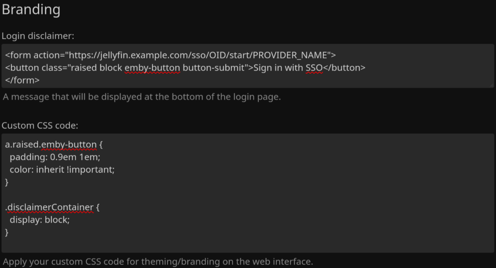

<h1 align="center">Jellyfin SSO Plugin</h1>

<p align="center">


<br/>
<br/>
<a href="https://github.com/Derksniff/jellyfin-plugin-sso">

</a>
<a href="https://github.com/Derksniff/jellyfin-plugin-sso/releases">

</a>
<a href="https://github.com/Derksniff/jellyfin-plugin-sso/releases.atom">

</a>
<a href="https://github.com/Derksniff/jellyfin-plugin-sso/commits/main.atom">

</a>
</p>

> **This is a continued fork.** The original [9p4/jellyfin-plugin-sso](https://github.com/9p4/jellyfin-plugin-sso) has been archived by its author. This fork picks up maintenance — it's updated for **Jellyfin 10.11** (targeting `net9.0`), with a faster, friendlier sign-in experience and ongoing bug fixes. See [What's new in the 4.x fork](#whats-new-in-the-4x-fork) below.

This plugin allows users to sign in through an SSO provider (such as Google, Microsoft, or your own provider). This enables one-click signin.

https://user-images.githubusercontent.com/17993169/149681516-f93b43f5-fa5c-4c1f-a909-e5414878a864.mp4

Existing users may link new SSO accounts, or remove existing links using self-service at `/SSOViews/linking`.

## Current State

This fork is actively maintained for Jellyfin 10.11. The plugin has an admin configuration page (so the API is optional, not mandatory), supports OpenID and SAML, and ships an improved login loading screen. PRs are welcome.

**This is for [Jellyfin 10.11](https://jellyfin.org/), and works on the Web UI or clients supporting [Quick Connect](https://jellyfin.org/docs/general/server/quick-connect).** For older Jellyfin versions (10.8–10.10), use a matching tag/release of the original [9p4 plugin](https://github.com/9p4/jellyfin-plugin-sso).

**This README reflects the branch it is currently on! Switch tags to view version-specific documentation!**

## What's new in the 4.x fork

- **4.0.0.7** — The loading page renders *before* the OpenID token exchange, so users see "Connecting to your account…" immediately instead of a blank browser tab while Jellyfin contacts the provider. Padlock icon on the loading screen.
- **4.0.0.6** — Login loading-screen polish: branding logo, provider name in status text, stuck-state timeout with *Try again*/*Return to login* buttons, fade-in animations (respecting `prefers-reduced-motion`), accessibility (aria-live, page title, favicon), and the correct device version reported to Jellyfin.
- **4.0.0.5** — Cache OIDC discovery per provider (endpoints + signing keys, 15-min TTL) to cut several IdP round trips per sign-in; animated login loading screen.
- **4.0.0.4** — Bug fixes: OIDC state-cleanup crash, thread-safe in-flight auth state (`ConcurrentDictionary`), `Unregister` now persists, null guards for providers without scopes/roles, SAML security fix.
- **4.0.0.0** — Updated for Jellyfin 10.11 (`net9.0`).

## Tested Providers

[Find provider specific documentation in providers.md](providers.md)

- Authelia
- authentik
- Keycloak
  - OIDC & SAML
- Pocket ID
- Kanidm
- Google OpenID: Works, but usernames are all numeric

## Supported Protocols

- [OpenID](https://openid.net/developers/how-connect-works/)
- [SAML](https://www.cloudflare.com/learning/access-management/what-is-saml/)

## Security

This program should be reasonably secure since it validates all information passed from the client with either a certificate or a secret internal state. As with any authentication plugin, review the configuration carefully before exposing it to the internet. See [SECURITY.md](SECURITY.md) for how to report vulnerabilities.

## Installing

### Plugin repository (recommended, auto-updates)

In Jellyfin: **Dashboard → Plugins → Repositories → Add**, and use this manifest URL:

```
https://raw.githubusercontent.com/Derksniff/jellyfin-plugin-sso/main/manifest.json
```

Then install **SSO Authentication** from the plugin catalog and restart Jellyfin.

### Manual install

Download `sso-auth_<version>.zip` from the [latest release](https://github.com/Derksniff/jellyfin-plugin-sso/releases), and extract its contents into a new folder under your Jellyfin `plugins/` directory (e.g. `plugins/sso-auth_<version>/`), then restart. The zip contains three DLLs: `SSO-Auth.dll`, `Duende.IdentityModel.OidcClient.dll`, and `Duende.IdentityModel.dll`. Existing SSO provider configuration carries over.

See [Contributing](#contributing) for instructions on how to build from source.

## Roadmap

- [x] Admin page
- [ ] Automated tests
- [x] Add role/claims support
- [x] Use canonical usernames instead of preferred usernames
- [x] Add user self-service
- [ ] Finalize RBAC access for all user properties

## Examples

### Creating A Login Button On The Main Page

In the Jellyfin administration UI, under "General", there is a "Branding" section. In that section, add the following code in the "Login disclaimer" block (replacing `PROVIDER_NAME` and the domain):

```html
<form action="https://jellyfin.example.com/sso/OID/start/PROVIDER_NAME">
  <button class="raised block emby-button button-submit">
    Sign in with SSO
  </button>
</form>
```

Then, add the following code in the "Custom CSS code" section:

```css
a.raised.emby-button {
  padding: 0.9em 1em;
  color: inherit !important;
}

.disclaimerContainer {
  display: block;
}
```



For more information, refer to [issue #16](https://github.com/9p4/jellyfin-plugin-sso/issues/16).

### SAML

Example for adding a SAML configuration with the API using [curl](https://curl.se/):

`curl -v -X POST -H "Content-Type: application/json" -d '{"samlEndpoint": "https://keycloak.example.com/realms/test/protocol/saml", "samlClientId": "jellyfin-saml", "samlCertificate": "Very long base64 encoded string here", "enabled": true, "enableAuthorization": true, "enableAllFolders": false, "enabledFolders": [], "adminRoles": ["jellyfin-admin"], "roles": ["allowed-to-use-jellyfin"], "enableFolderRoles": true, "folderRoleMapping": [{"role": "allowed-to-watch-movies", "folders": ["cc7df17e2f3509a4b5fc1d1ff0a6c4d0", "f137a2dd21bbc1b99aa5c0f6bf02a805"]}]}' "https://myjellyfin.example.com/sso/SAML/Add/PROVIDER_NAME?api_key=API_KEY_HERE"`

Make sure that the JSON is the same as the configuration you would like.

The SAML provider must have the following configuration (I am using Keycloak, and I cannot speak for whatever you will see):

- Sign Documents on
- Sign Assertions off
- Client Signature Required off
- Redirect URI: [https://myjellyfin.example.com/sso/SAML/post/PROVIDER_NAME](https://myjellyfin.example.com/sso/SAML/start/PROVIDER_NAME)
- Base URL: [https://myjellyfin.example.com](https://myjellyfin.example.com)
- Master SAML processing URL: [https://myjellyfin.example.com/sso/SAML/start/PROVIDER_NAME](https://myjellyfin.example.com/sso/SAML/start/PROVIDER_NAME)

Make sure that `clientid` is replaced with the actual client ID and `PROVIDER_NAME` is replaced with the chosen provider name!

### OpenID

Example for adding an OpenID configuration with the API using [curl](https://curl.se/)

`curl -v -X POST -H "Content-Type: application/json" -d '{"oidEndpoint": "https://keycloak.example.com/realms/test", "oidClientId": "jellyfin-oid", "oidSecret": "short secret here", "enabled": true, "enableAuthorization": true, "enableAllFolders": false, "enabledFolders": [], "adminRoles": ["jellyfin-admin"], "roles": ["allowed-to-use-jellyfin"], "enableFolderRoles": true, "folderRoleMapping": [{"role": "allowed-to-watch-movies", "folders": ["cc7df17e2f3509a4b5fc1d1ff0a6c4d0", "f137a2dd21bbc1b99aa5c0f6bf02a805"]}], "roleClaim": "realm_access", "oidScopes" : [""]}' "https://myjellyfin.example.com/sso/OID/Add/PROVIDER_NAME?api_key=API_KEY_HERE"`

The OpenID provider must have the following configuration (again, I am using Keycloak)

- Access Type: Confidential
- Standard Flow Enabled
- Redirect URI: [https://myjellyfin.example.com/sso/OID/redirect/PROVIDER_NAME](https://myjellyfin.example.com/sso/OID/redirect/PROVIDER_NAME)
- Base URL: [https://myjellyfin.example.com](https://myjellyfin.example.com)

Make sure that `clientid` is replaced with the actual client ID and `PROVIDER_NAME` is replaced with the chosen provider name!

## API Endpoints

The API is all done from a base URL of `/sso/`

### SAML

#### Flow

- POST `SAML/start/PROVIDER_NAME`: This is the SAML POST endpoint. It accepts a form response from the SAML provider and returns HTML and JavaScript for the client to login with a given provider name.
- GET `SAML/start/PROVIDER_NAME`: This is the SAML initiator: it will begin the authorization flow for SAML with a given provider name.
- POST `SAML/Auth/PROVIDER_NAME`: This is the SAML client-side API: the HTML and JavaScript client will call this endpoint to receive Jellyfin credentials given a provider name. Post format is in JSON with the following keys:
  - `deviceId`: string. Device ID.
  - `deviceName`: string. Device name.
  - `appName`: string. App name.
  - `appVersion`: string. App version.
  - `data`: string. The signed SAML XML request. Used to verify a request.

#### Configuration

These all require authorization. Append an API key to the end of the request: `curl "http://myjellyfin.example.com/sso/SAML/Get?api_key=API_KEY_HERE"`

- POST `SAML/Add/PROVIDER_NAME`: This adds or overwrites a configuration for SAML for the given provider name. It accepts JSON with the following keys and format:
  - `samlEndpoint`: string. The SAML endpoint.
  - `samlClientId`: string. The SAML client ID.
  - `samlCertificate`: string. The base64 encoded SAML certificate.
  - `enabled`: boolean. Determines if the provider is enabled or not.
  - `enableAuthorization`: boolean: Determines if the plugin sets permissions for the user. If false, the user will start with no permissions and an administrator will add permissions. If disabled, then the permissions of users will not be modified and the Jellyfin defaults will be used instead.
  - `enableAllFolders`: boolean. Determines if the client logging in is allowed access to all folders.
  - `enabledFolders`: array of strings. If `enableAllFolders` is set to false, then this will be used to determine what folders the users who log in through this provider are allowed to use.
  - `roles`: array of strings. This validates the SAML response against the `Role` attribute. If a user has any of these roles, then the user is authenticated. Leave blank to disable role checking.
  - `adminRoles`: array of strings. This uses SAML response's `Role` attributes. If a user has any of these roles, then the user is an admin. Leave blank to disable (default is to not enable admin permissions).
  - `enableFolderRoles`: boolean. Determines if role-based folder access should be used.
  - `folderRoleMapping`: object in the format "role": string and "folders": array of strings. The user with this role will have access to the following folders if `enableFolderRoles` is enabled. To get the IDs of the folders, GET the `/Library/MediaFolders` URL with an API key. Look for the `Id` attribute.
  - `enableLiveTvRoles`: boolean. Determines if role-based Live TV access should be used.
  - `liveTvRoles`: array of strings. If `enableLiveTvRoles` is enabled, then the user's roles will be checked against these. If the user is granted permission, then the user will be able to view Live TV.
  - `liveTvManagementRoles`: array of strings. If `enableLiveTvRoles` is enabled, then the user's roles will be checked against these. If the user is granted permission, then the user will be able to manage Live TV.
  - `enableLiveTv`: boolean. Whether to allow Live TV by default. This applies even if `enableLiveTvRoles` is enabled.
  - `enableLiveTvManagement`: boolean. Whether to allow Live TV management by default. This applies even if `enableLiveTvRoles` is enabled.
  - `defaultProvider`: string. The set provider then gets assigned to the user after they have logged in. If it is not set, nothing is changed. With this, a user can login with SSO but is still able to log in via other providers later. See the `Unregister` endpoint.
  - `schemeOverride`: string. Sets the scheme for URLs used. Can be useful if the plugin refuses to use HTTPS URLs.
- GET `SAML/Del/PROVIDER_NAME`: This removes a configuration for SAML for a given provider name.
- GET `SAML/Get`: Lists the configurations currently available.

### OpenID

#### Flow

- GET `OID/redirect/PROVIDER_NAME`: This is the OpenID callback path. This will return HTML and JavaScript for the client to login with a given provider name.
- GET `OID/start/PROVIDER_NAME`: This is the OpenID initiator: it will begin the authorization flow for OpenID with a given provider name.
- POST `OID/Auth/PROVIDER_NAME`: This is the OpenID client-side API: the HTML and JavaScript client will call this endpoint to receive Jellyfin credentials for a given provider name. Post format is in JSON with the following keys:
  - `deviceId`: string. Device ID.
  - `deviceName`: string. Device name.
  - `appName`: string. App name.
  - `appVersion`: string. App version.
  - `data`: string. The OpenID state. Used to verify a request.

#### Configuration

These all require authorization. Append an API key to the end of the request: `curl "http://myjellyfin.example.com/sso/OID/Get?api_key=9c6e5fae4ae145669e6b7a3942f813b7"`

- POST `OID/Add/PROVIDERNAME`: This adds or overwrites a configuration for OpenID with a given provider name. It accepts JSON with the following keys and format:
  - `oidEndpoint`: string. The OpenID endpoint. Must have a `.well-known` path available.
  - `oidClientId`: string. The OpenID client ID.
  - `oidSecret`: string. The OpenID secret.
  - `enabled`: boolean. Determines if the provider is enabled or not.
  - `enableAuthorization`: boolean: Determines if the plugin sets permissions for the user. If false, the user will start with no permissions and an administrator will add permissions. If disabled, then the permissions of users will not be modified and the Jellyfin defaults will be used instead.
  - `enableAllFolders`: boolean. Determines if the client logging in is allowed access to all folders.
  - `enabledFolders`: array of strings. If `enableAllFolders` is set to false, then this will be used to determine what folders the users who log in through this provider are allowed to use.
  - `roles`: array of strings. This validates the OpenID response against the claim set in `roleClaim`. If a user has any of these roles, then the user is authenticated. Leave blank to disable role checking. This currently only works for Keycloak (to my knowledge).
  - `adminRoles`: array of strings. This uses the OpenID response against the claim set in `roleClaim`. If a user has any of these roles, then the user is an admin. Leave blank to disable (default is to not enable admin permissions).
  - `enableFolderRoles`: boolean. Determines if role-based folder access should be used.
  - `folderRoleMapping`: object in the format "role": string and "folders": array of strings. The user with this role will have access to the following folders if `enableFolderRoles` is enabled. To get the IDs of the folders, GET the `/Library/MediaFolders` URL with an API key. Look for the `Id` attribute.
  - `enableLiveTvRoles`: boolean. Determines if role-based Live TV access should be used.
  - `liveTvRoles`: array of strings. If `enableLiveTvRoles` is enabled, then the user's roles will be checked against these. If the user is granted permission, then the user will be able to view Live TV.
  - `liveTvManagementRoles`: array of strings. If `enableLiveTvRoles` is enabled, then the user's roles will be checked against these. If the user is granted permission, then the user will be able to manage Live TV.
  - `enableLiveTv`: boolean. Whether to allow Live TV by default. This applies even if `enableLiveTvRoles` is enabled.
  - `enableLiveTvManagement`: boolean. Whether to allow Live TV management by default. This applies even if `enableLiveTvRoles` is enabled.
  - `roleClaim`: string. This is the value in the OpenID response to check for roles. For Keycloak, it is `realm_access.roles` by default. The first element is the claim type, the subsequent values are to parse the JSON of the claim value. Use a "\\." to denote a literal ".". This expects a list of strings from the OIDC server.
  - `oidScopes` : array of strings. Each contains an additional scope name to include in the OIDC request.
    - For some OIDC providers (For example, [authelia](https://github.com/9p4/jellyfin-plugin-sso/issues/23#issuecomment-1112237616)), additional scopes may be required in order to validate group membership in role claim.
    - Leave empty to only request the default scopes.
  - `defaultProvider`: string. The set provider then gets assigned to the user after they have logged in. If it is not set, nothing is changed. With this, a user can login with SSO but is still able to log in via other providers later. See the `Unregister` endpoint.
  - `defaultUsernameClaim`: string. The provider will use the claim to create the users' usernames. If not set, it fallbacks to `preferred_username`.
  - `avatarUrlFormat`: string. The URL format for the users avatars. OIDC claims can be used by using the `@{claim_type}` syntax. If not set, the avatars won't change.
  - `disableHttps`: boolean. Determines whether the OpenID discovery endpoint requires HTTPS.
  - `doNotValidateEndpoints`: boolean. Determines whether the OpenID discovery process will validate endpoints. This may be required for Google.
  - `doNotValidateIssuerName`: boolean. Determines whether the OpenID discovery process will validate the OpenID issuer name.
  - `schemeOverride`: string. Sets the scheme for URLs used. Can be useful if the plugin refuses to use HTTPS URLs.
- GET `OID/Del/PROVIDER_NAME`: This removes a configuration for OpenID for a given provider name.
- GET `OID/Get`: Lists the configurations currently available.
- GET `OID/States`: Lists currently active OpenID flows in progress.

### Misc

- POST `Unregister/username`: This "unregisters" a user from SSO. A JSON-formatted string must be posted with the new authentication provider. To reset to the default provider, use `Jellyfin.Server.Implementations.Users.DefaultAuthenticationProvider` like so: `curl -X POST -H "Content-Type: application/json" -d '"Jellyfin.Server.Implementations.Users.DefaultAuthenticationProvider"' "https://myjellyfin.example.com/sso/Unregister/username?api_key=API_KEY`

## Limitations

Logging in with an SSO account that has the same username as an existing Jellyfin account will override the permissions for the user. Use caution when overriding the administrator account!

~~There is no GUI to sign in. You have to make it yourself! The buttons should redirect to something like this: [https://myjellyfin.example.com/sso/SAML/start/clientid](https://myjellyfin.example.com/sso/SAML/start/clientid) replacing `clientid` with the provider client ID and `SAML` with the auth scheme (either `SAML` or `OID`).~~

~~Furthermore, there is no functional admin page (yet). PRs for this are welcome. In the meantime, you have to interact with the API to add or remove configurations.~~ Added by [strazto](https://github.com/strazto) in PR [#18](https://github.com/9p4/jellyfin-plugin-sso/pull/18) and [#27](https://github.com/9p4/jellyfin-plugin-sso/pull/27).

There is also no logout callback. Logging out of Jellyfin will log you out of Jellyfin only, instead of the SSO provider as well.

~~This only supports Jellyfin on its own domain (for now). This is because I'm using string concatenation for generating some URLs. A PR is welcome to patch this.~~ Fixed in [PR #1](https://github.com/9p4/jellyfin-plugin-sso/pull/1).

**This only works on the web UI**. ~~The user must open the Jellyfin web UI BEFORE using the SSO program to populate some values in the localStorage.~~ Fixed by implementing a comment by [Pfuenzle](https://github.com/Pfuenzle) in [Issue #5](https://github.com/9p4/jellyfin-plugin-sso/issues/5#issuecomment-1041864820).

# Contributing

## Dependencies

This project uses Nix flakes to manage development dependencies. Run `nix develop` to use the same toolchain versions.

## Building

This is built with **.NET 9.0**. From the repo root:

```bash
dotnet publish SSO-Auth/SSO-Auth.csproj -c Release -o dist/publish
```

Copy the `SSO-Auth.dll`, `Duende.IdentityModel.OidcClient.dll`, and `Duende.IdentityModel.dll` files from `dist/publish` into a new folder under your Jellyfin configuration: `config/plugins/sso`. (Only those three DLLs are needed — the rest of the publish output, such as `Newtonsoft.Json.dll` and the `Jellyfin.*` assemblies, is provided by the Jellyfin host.)

## Releasing

Releases are cut manually:

1. Bump `<AssemblyVersion>`/`<FileVersion>` in `SSO-Auth/SSO-Auth.csproj` and `version:` in `build.yaml`, and add a `changelog:` line to `build.yaml`.
2. `dotnet publish` (as above), then zip exactly the three DLLs listed above at the archive root as `sso-auth_<version>.zip`.
3. Add a new entry at the top of the `versions` array in `manifest.json` (version, changelog, `targetAbi`, `sourceUrl`, MD5 `checksum`, UTC `timestamp`).
4. Publish a GitHub release tagged `v<version>` with the zip attached.

## Credits and Thanks

This plugin is a continued fork of [9p4/jellyfin-plugin-sso](https://github.com/9p4/jellyfin-plugin-sso) by [@9p4](https://github.com/9p4) and contributors. All of the original work — the protocol implementations, the admin page (by [strazto](https://github.com/strazto)), and years of fixes — is theirs; this fork carries it forward for Jellyfin 10.11.

Much thanks to the [Jellyfin LDAP plugin](https://github.com/jellyfin/jellyfin-plugin-ldapauth) for offering a base for the original plugin.

The plugin uses the [AspNet SAML](https://github.com/jitbit/AspNetSaml/) library for the SAML side of things (patched to work with Base64 on non-Windows machines), and the [Duende IdentityModel OIDC Client](https://github.com/DuendeSoftware/foss) library for the OpenID side.

Thanks to these projects, without which implementing these protocols from scratch would have been a headache.